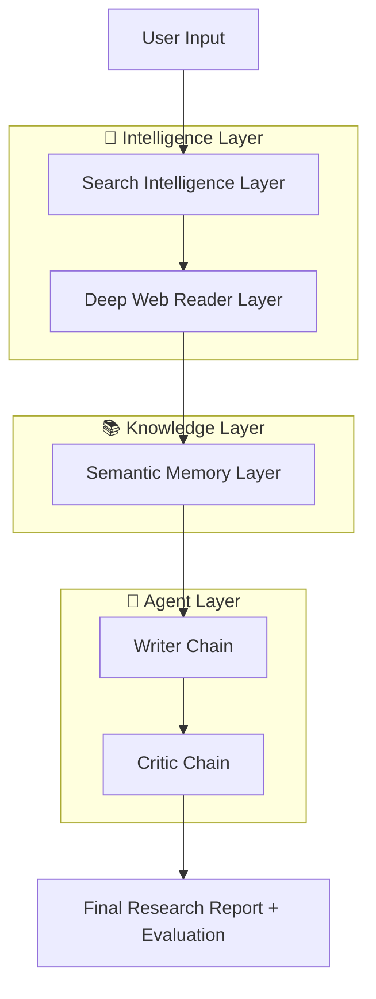
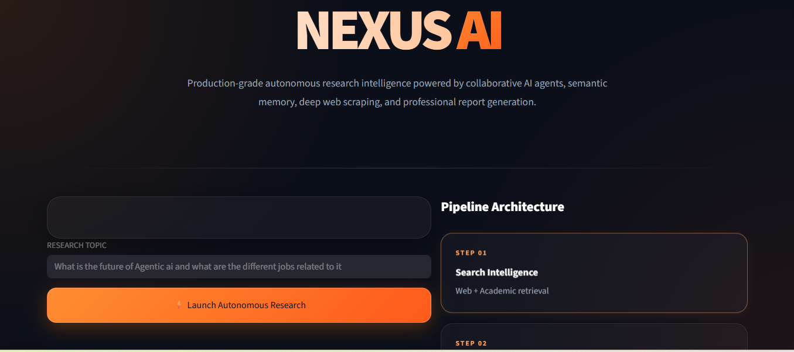
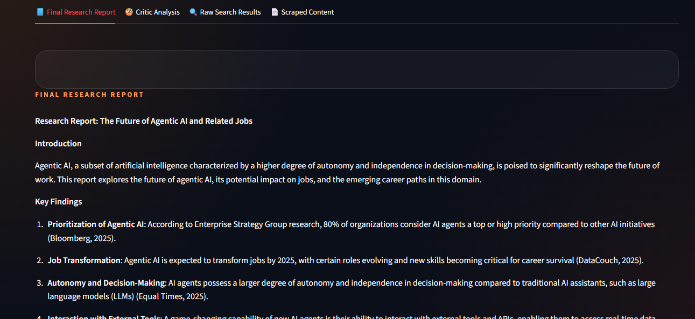

# NEXUS AI — Autonomous Multi-Agent Research Intelligence System


**An enterprise-grade autonomous AI research platform** that conducts deep, multi-source research and generates professional reports with built-in quality evaluation — powered by multi-agent systems and semantic memory.

---

## ✨ Project Overview

**NEXUS AI** is a production-ready autonomous research intelligence system that mimics the workflow of a professional research team. It autonomously gathers information from the web and academic sources, deeply understands content through scraping and semantic indexing, generates high-quality structured reports, and self-evaluates its own output.

Built with cutting-edge AI engineering practices, NEXUS demonstrates advanced capabilities in **multi-agent orchestration**, **retrieval-augmented generation (RAG)**, **asynchronous data pipelines**, and **self-reflective AI systems**.

### Why This Project Matters

In an era of information overload, NEXUS AI represents the future of knowledge work — transforming vague research topics into comprehensive, cited, high-quality reports in minutes, with transparency and quality control built in.

---
## 🏗️ System Architecture



### Core Pipeline Workflow

1. **Search Intelligence Layer**  
   - Tavily Web Search + Arxiv API  
   - Retrieves latest web results and academic papers

2. **Deep Web Reader Layer**  
   - URL extraction and deduplication  
   - Asynchronous scraping using `aiohttp` + `Playwright`  
   - Handles both static and JavaScript-rendered pages

3. **Semantic Memory Layer**  
   - Document chunking and embedding using Sentence Transformers  
   - Storage in **ChromaDB** vector database  
   - Contextual retrieval using similarity search (RAG)

4. **Writer Chain**  
   - LangChain-based LLM chain  
   - Generates professional, structured research reports (Introduction, Key Findings, Technical Analysis, Conclusion, Sources)

5. **Critic Chain**  
   - Independent evaluation agent  
   - Detects hallucinations, logical gaps, unsupported claims, and completeness issues  
   - Provides scoring and improvement suggestions

---

## 🚀 Key Features

- **Fully Autonomous Research** — Zero manual intervention required
- **Multi-Agent Architecture** — Specialized Writer + Critic agents
- **Hybrid Intelligence** — Web + Academic sources
- **Dynamic Web Scraping** — Async + headless browser support
- **Long-term Semantic Memory** — Persistent vector database
- **Self-Improving Output** — Built-in critic and quality gate
- **Production UI** — Beautiful, responsive Streamlit interface
- **Professional Reports** — Structured with sources and citations
- **RAG-Powered** — Retrieval Augmented Generation for accuracy

---

## 🛠️ Tech Stack

| Layer                    | Technology                          | Purpose |
|-------------------------|-------------------------------------|--------|
| **Frontend**            | Streamlit                           | Production-grade UI |
| **Orchestration**       | LangChain + Pydantic                | Agent chains & validation |
| **LLM**                 | Mistral AI                          | Reasoning & generation |
| **Search**              | Tavily + Arxiv API                  | Intelligence gathering |
| **Scraping**            | aiohttp + Playwright + BeautifulSoup| Deep web reading |
| **Vector Database**     | ChromaDB                            | Semantic memory |
| **Embeddings**          | Sentence Transformers               | High-quality vectors |
| **Async Runtime**       | asyncio + aiohttp                   | Performance |
| **UI/UX**               | Custom CSS + Responsive Design      | Enterprise feel |

---

## 📁 Project Structure

```bash
nexus-ai/
├── agents.py
├── tools.py                    # All tools used
├── app.py                      # Main Streamlit UI
├── pipeline.py                 # Research pipeline logic
├── requirements.txt
├── .env.example
└── README.md
```

---

## ⚙️ Installation & Setup

### 1. Clone the Repository

```bash
git clone https://github.com/AkarshVyas/Multi-agent-research-system.git
cd Multi-agent-research-system
```

### 2. Create Virtual Environment

```bash
python -m venv venv
source venv/bin/activate        # On Windows: venv\Scripts\activate
```

### 3. Install Dependencies

```bash
pip install -r requirements.txt
```

### 4. Environment Variables

```bash
cp .env.example .env
```

### 5. Add API Keys

```env
TAVILY_API_KEY=your_tavily_key_here
MISTRAL_API_KEY=your_mistral_key_here
```

---

## ▶️ Running Locally

```bash
streamlit run app.py
```

The application will be available at `http://localhost:8501`

---

## 📸 Screenshots





---

## 🧠 AI Architecture Deep Dive

### Multi-Agent Systems
NEXUS uses a **multi-agent** design where specialized agents (Writer & Critic) collaborate. This significantly improves output quality compared to single LLM calls.

### Semantic Memory & Vector Database
- Uses **ChromaDB** — a lightweight, high-performance vector store
- **Sentence Transformers** embeddings for semantic understanding
- Enables **long-term memory** across research sessions

### Retrieval Augmented Generation (RAG)
Retrieves relevant, up-to-date context from the vector database before generation, dramatically reducing hallucinations.

### Async Scraping Architecture
Parallel asynchronous scraping using `asyncio` + `aiohttp` + `Playwright` ensures speed and resilience.

---

## ⚡ Performance Optimizations

- Asynchronous web scraping
- Efficient document chunking
- Smart URL deduplication
- Vector similarity search with top-k retrieval
- Streaming UI updates

---

## 🌟 Why This Project is Advanced

- Demonstrates **production AI engineering** practices
- Implements true **autonomous agentic workflows**
- Combines **web intelligence + academic research**
- Features **self-reflection** through critic agent
- Production-ready UI/UX with enterprise aesthetics

### Resume-Worthy Highlights
- Built a complete **multi-agent autonomous system**
- Implemented **RAG** with vector databases
- Designed **asynchronous scraping pipelines**
- Created **self-evaluating AI** using critic chains

---

## 📈 Real-World Applications

- Market research automation
- Academic literature reviews
- Competitive intelligence
- Technical due diligence
- Scientific trend analysis
- Investment research

---

## 🛣️ Future Roadmap

- [ ] Multi-modal support (PDFs, images, tables)
- [ ] Persistent agent memory across sessions
- [ ] WebSocket streaming responses
- [ ] Multi-LLM routing
- [ ] API endpoints for integration
- [ ] User feedback & fine-tuning loop

---

## 🤝 Contributing

Contributions are welcome! Feel free to open issues or submit Pull Requests.

---

## 📜 License

This project is licensed under the **MIT License**.

---

## 👨‍💼 Author

**Digvijay Bhonsle**  
*AI Engineer | Building autonomous intelligence systems*

---

<div align="center">

**Made with ❤️ for the future of AI research**

**NEXUS AI — Where Intelligence Meets Autonomy**

</div>
